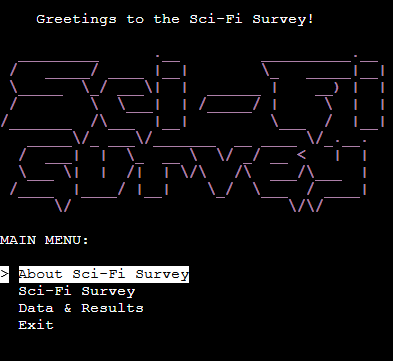
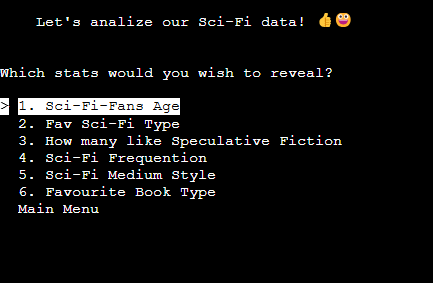
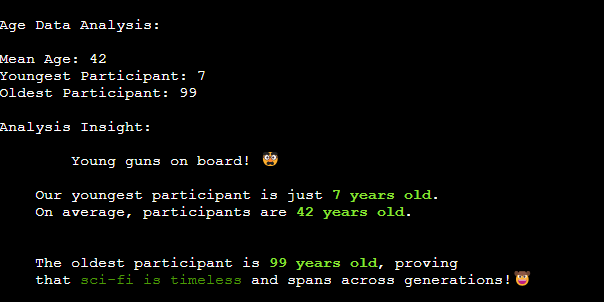
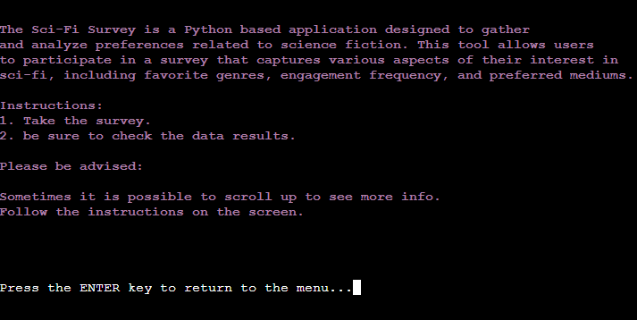
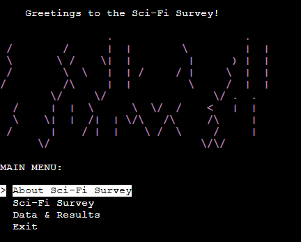
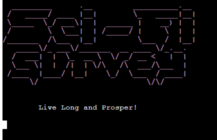

# Sci-Fi Survey!
The Sci-Fi Survey is a Python-based aplpication designed to gather and analyze preferences related to science fiction. This tool allows users to participate in a survey that captures various aspects of their interest in sci-fi, including favorite genres, engagement frequency and preferred mediums.

The app can be accessed here:
[Sci-Fi Survey](https://sci-fi-survey-f66a7ae41cb5.herokuapp.com/)



# Intro

Jump in and check where your sci-fi interests lay in our little sci-fi society. The data is valuable and interesting because of my love for sci-fi I'd want to know how people interact with sci-fi. The app is designed for the sci-fi fans of ages between 7 and 99 as target audience.

# Features
 - Interactive Survey - Users are guided through a series of questions about their age, favorite sci-fi genres and engagement habits using a terminal based interface. The survey also includes optios for users to specify their preferences for speculative ficiton, sci-fi mediums and book types. During the age questions data is validated and if User provides not number between 7 to 99 appropriate error displays prompting user to enter valid input data.


 - Data Storage - Survey responses are stored in a Google Sheet for easy management and anlysis. This integration allows for seamless data collection and ensures that all user inputs are recorded accurately.



 - Data Analysis - The application processes the collected data using Pandas, enabling detailed analysis and visualization. Users can explore varous insights such as:
    - Age demographics of participants
    - Popularity of different sci-fi genres
    - Frequency of engagement with sci-fi content
    - Preferences for sci-fi mediums and book types
    - Correlation between engagement frequency and insterest in speculative ficiton
    - Sci-fi genre preferences across different age groups

    


- About Section - Displays information about the applications purpose and instructions.



- User-Friendly Interface - The terminal interface includes dynamic menus and color-coded outputs to enhance the user experience. The use of the 'simple_term_menu' and 'colorama' libraries ensures that navigation is intuitive and visually appealing.

# User Stories
1. As a Sci-Fi Enthusiast, I want to participate in the Sci-Fi Survey so that I can share my preferences for different sci-fi genres, mediums, and books with the community.

2. As a Data Analyst, I want to access and analyze the survey results so that I can gain insights into the demographics and preferences of sci-fi fans, helping to identify trends and popular genres.

3. As a Developer, I want to understand how the survey data is stored and processed so that I can contribute to improving the codebase, adding new features, or optimizing the existing functionalities.

4. As a Sci-Fi Content Creator, I want to explore the survey results so that I can tailor my content (books, movies, games) to better align with the interests and preferences of the sci-fi community.

# Technologies Used
- Python - The core programming language for building the survey and data analysis functionalities.
- Google Sheets API - For storing and managing survey responses.
- Pandas - For data manipulation and analysis.
- TerminalMenu - For creating interactive menus in the terminal.
- Colorama - For adding color to terminal output to improve readability.
- GSpread - for working with Google Sheets, used for storing and retrieving survey data.
- datetime - used for creating a timestamp
- time - used to pause terminal for few seconds according to the setting.
- platform - os - used to clear the screen regardles of operating system - Windows or Linux based systems.
- Heroku - application for cloud hosting of the Sci-Fi Survey.
- GitHub - Repository hosting services
- GitPod - Used to write and commit the code

# Requirements
- The Sci-Fi Survey uses the following list of requirements:

cachetools==5.4.0
colorama==0.4.6
emoji==2.12.1
google-auth==2.32.0
google-auth-oauthlib==1.2.1
gspread==6.1.2
numpy==2.0.1
oauthlib==3.2.2
pandas==2.2.2
pyasn1==0.6.0
pyasn1_modules==0.4.0
pytz==2024.1
requests-oauthlib==2.0.0
rsa==4.9
simple-term-menu==1.6.4
tabulate==0.9.0
tzdata==2024.1

# Code
The code was written in Python 3.12.2(main, Aug 6 2024) and has been organized into seperate files according to the function contirbuting to improved functionality and creating ease of access and editing:
1. run.py = files acts like the entry point file for the Sci-Fi Survey application. It displays the greetings and the main menu.
2. menu.py = is a helper file helping preserve the DRY rules with providing the menu creator code for various functions and with the use of simple_term_menu
3. about.py = is the file providing information about the applciation and simple instructions how to use the program.
4. survey.py = this file contains the entire survey content, including all the questions and answers created with the create_menu function. It also is programmed to store the data in the google sheet file.
5. data_analysis.py = this file contains data analysis information. Creates the menu for the sci-fi data and contains most of the functionalities that communicate with the google sheet and analyse the data - but not all functions, which because of their size were transferred to following files for ease of access and better organization of the program. These files are:
    - age_data.py - this is rather large file containing all the age related calculations, crossing age with all the other data available from the survey. The results are displaying and for the ease of access results pause after each section, so it is easier to understand that it's possible to scroll up in this section for various results.
    - speculative_fiction_data.py = these interesting data also contain few crosssection results and can be scrolled up to read in full.
6. google_sheets.py = this file contains all the information related to the communication with the google sheets, including credential, and the gspread and pandas integration. 
7. utils.py = this file contains helper functions necessary for optimal work of the code. Functions like clear_screen, and go_back_to_results_menu are used to improve readability and functionality of the application. The print_section function helps displaying the survey questions and possible answers. This file also contains our beautiful ASCII art greetings_msg which serves the purpose of the Sci-Fi survey Logo. 

# Manual Testing

The app deployed with Heroku has gone through manual testing via Chrome, Edge, Firefox and Opera. There have been spotted bugs reported in unresolved bugs sections. Besides that, app works flawlessly in all environments. Heroku Deployment was sent to my friends and family who participated in the survey and have given feedback on user experience and did not report any bugs.

| **Test Case** | **Actions** | **Expected Results** | **Pass** |
| --- | --- | --- | --- |
Survey Launch Test|Run the main() function to start the program.|The main menu is displayed with options for "About Sci-Fi Survey," "Sci-Fi Survey," "Data & Results," and "Exit."|	Yes
Age Input Validation|Start the Sci-Fi Survey and input invalid data like "abc" or "5.5" when prompted for age.|	The system displays an error message asking the user to enter a valid whole number between 7 and 99. | Yes
Sci-Fi Type Selection|	Start the Sci-Fi Survey and select a sci-fi type from the list.|	The selected sci-fi type is stored correctly and displayed in the final survey response summary.|Yes
Speculative Fiction Preference Test|	Start the Sci-Fi Survey and select "Yes" or "No" when asked if the user likes speculative fiction.|	The response is correctly recorded and shown in the summary.| Yes	
Engagement Frequency Selection|	Start the Sci-Fi Survey and select an engagement frequency (e.g., "Daily" or "Weekly").|	The selected frequency is correctly recorded and shown in the final summary of survey responses.	| Yes
Survey Data Storage Test|	Complete the Sci-Fi Survey and check Google Sheets to ensure the data is appended correctly.|	All survey data, including timestamp, age, and responses, is appended to the appropriate Google Sheet.	| Yes
Data Results Display Test|	Navigate to the "Data & Results" section from the main menu.|	The program correctly displays data analysis results like age distribution, sci-fi type preferences, etc.	| Yes
Age Group Analysis Test	|Select the "Favourite Sci-Fi by Age Group" option from the Data & Results menu.|	The program displays correct data analysis showing the most popular sci-fi types for each age group.| Yes
Exit Program|	Select the "Exit" option from the main menu.|	The program displays the message "Live Long and Prosper!" and exits without errors.| Yes


# Deployment

Follow these steps to deploy the Sci-Fi Survey on your local machine.

1. Clone the Sci-Fi Survey repository to your local machine with the following command:
    
    ```sh
    git clone https://github.com/cptvalleyberg84/sci-fi-survey.git
    ```

2. Install the required dependencies:

    ```sh
    pip3 install -r requirements.txt
    ```

3. Database Setup:
     Follow these steps to set up the Google Sheets integration:

     - Google Sheets Credentials:
        Create a service account and obtain a JSON key file. Add the JSON key file into the root directory. Follow the instructions [here](https://docs.appodeal.com/faq-and-troubleshooting/faq/generate-the-json-file-in-google-cloud). 

     - Access and Permissions:
        Share the Google Sheets document with the email address associated with your service account. Follow the instructions [here](https://datalab-docs.datacamp.com/connect-to-data/google-sheets).

        Update your credentials and settings in the `google_sheets.py` file.
        Be sure to name your google sheet file "sci-fi-data" or update this part in the `google_sheets.py` file.

4. Start the application by running:

      ```sh
      python run.py
      ```

5. Deployment to Hosting Platform (Optional):
- If you wish to deploy it to a platform like Heroku, check the platform's documentation for the details.

# Bugs / Unresolved Bugs

- Massive problems with cutting the line length to 79 required characters. Solved with editing the code, and cutting lines with the brackets as much as possible. There were tough following issues with PEP8 Scanner and few Print f' string messages where PEP8 didn't recognize i.e. % symbol as string but thought it was operator - which had minor influence on how the code prints.
- Bugs during splitting the code functions into separated files mostly due to a circular import. Solved after learning that we can call importing functions from different files within the function that needs it.
- Multiple bugs during learning how to print the ASCII art for the Logo of the application. Solved with learning specific Print f string method.
- Multiple issues with formating the functions of Data Results section including understanding how many calculations is possible to create to print inside the data section, understanding we can create the create_menu function and in similar way use the code according to the DRY philosophy. 
- CI Python Linter reported 'W605 invalid escape sequence' in the file utils.py for the whole ASCII Art generated SCI-FI Survey Purple HEADING-Logo. Solved by changing the f string print method to r string print method.
- DataFrame.value_counts could not pass without triggering the warning which after googling was solved with adding observed=False to the code line and removing trigger to this error.

## Unresolved Bugs
- Sometimes in Chrome or Edge browser the LOGO in Heroku may display incorrectly as in the picture:



- In firefox it sometimes display only half of the emojis (left half it seems)

# Resources

- [simple-term-menu 1.6.4](https://pypi.org/project/simple-term-menu/)
- [gspread](https://docs.gspread.org/en/v6.1.2/)
- [pandas 2.2.2](https://pypi.org/project/pandas/)
- [10 minutes to pandas](https://pandas.pydata.org/pandas-docs/stable/user_guide/10min.html)
- [pandas.DataFrame](https://pandas.pydata.org/docs/reference/api/pandas.DataFrame.html)
- [pandas.to_numeric](https://pandas.pydata.org/docs/reference/api/pandas.to_numeric.html#pandas-to-numeric)
- [pandas.Series.value_counts](https://pandas.pydata.org/docs/reference/api/pandas.Series.value_counts.html)
- [pandas.DataFrame.idxmax](https://pandas.pydata.org/docs/reference/api/pandas.DataFrame.idxmax.html)
- [Python | pandas.to_numeric method](https://www.geeksforgeeks.org/python-pandas-to_numeric-method/)
- [Platform Module in Python](https://www.geeksforgeeks.org/platform-module-in-python/)
- [tabulate 0.9.0](https://pypi.org/project/tabulate/)
- [colorama 0.4.6](https://pypi.org/project/colorama/)
- [Print Colored Text in Python](https://medium.com/ai-does-it-better/print-colored-text-in-python-enhance-terminal-output-b90aede058c8)
- [emoji 2.12.1](https://pypi.org/project/emoji/)
- [Full Emoji List, v15.1](https://unicode.org/emoji/charts/full-emoji-list.html)
- [pandas.crosstab](https://pandas.pydata.org/docs/reference/api/pandas.crosstab.html)
- [Python program to print Emojis](https://www.geeksforgeeks.org/python-program-to-print-emojis/)
- [How to clear screen in python?](https://www.geeksforgeeks.org/clear-screen-python/)
- [OS Module in Python with Examples](https://www.geeksforgeeks.org/os-module-python-examples/)
- [Make Python Wait For a Pressed Key](https://www.geeksforgeeks.org/make-python-wait-for-a-pressed-key/)
- [How do I make a time delay?](https://stackoverflow.com/questions/510348/how-do-i-make-a-time-delay)
- [The Python Requirements File and How to Create it](https://learnpython.com/blog/python-requirements-file/)
- [Python ValueError Exception Handling Examples](https://www.digitalocean.com/community/tutorials/python-valueerror-exception-handling-examples)

- [Text to ASCII Art Generator](https://patorjk.com/software/taag/#p=display&h=3&v=2&f=Graffiti&t=Sci-Fi%0A%20survey)
- [Print full ascii art](https://stackoverflow.com/questions/23623288/print-full-ascii-art)
- [BUG: Un-actionable FutureWarning in DataFrame.value_counts with categorical column(s)](https://github.com/pandas-dev/pandas/issues/54775)

# Credits

Thank you to the Code Institute Python Essentials course.

I'd love to say thank you to the CI Tutor team for the help and support.

Big **THANK YOU** to my amazing Mentor Juliia_Konn for guidance and additional tips and tricks!



###### End of Project